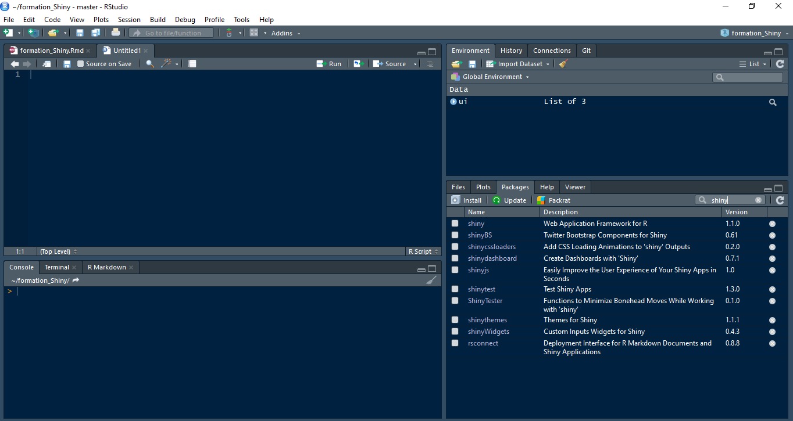
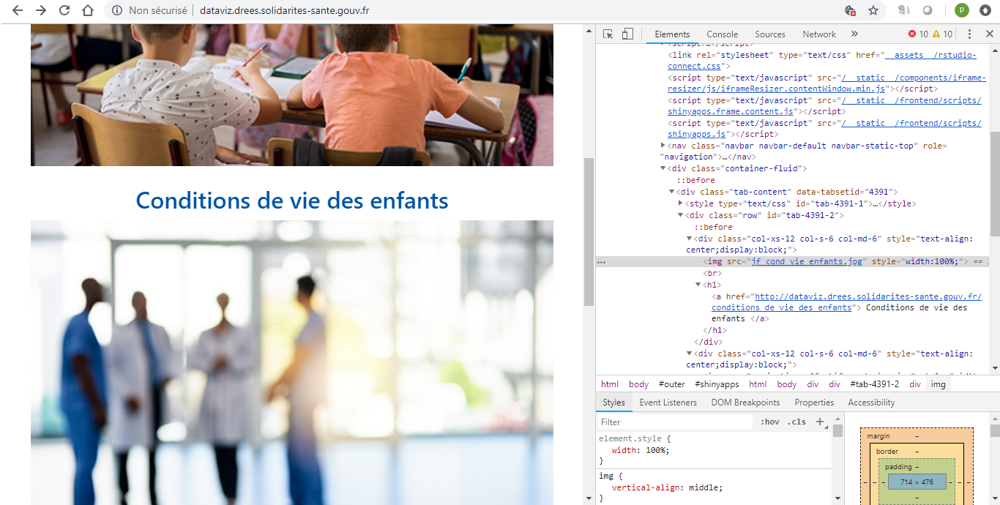

# Préambule 

Début à 9h30,on prévoit 30 minutes pour vérifier les accès Gitlab et le bon fonctionnement de RStudio pour tout le monde. On pourra aussi prendre le temps d'expliquer l'interface RStudio pour ceux qui ne sont pas venus en <a href="https://gitlab.com/DREES_code/OUTILS/R_initiation_juin2018">formation R Initiation</a>.

# Introduction : 

## Qu'est-ce que Shiny ?

Shiny permet de développer des sites web interactifs et réactifs pour mettre en valeur des données ie des sites web <i>data-driven </i>.<br>
Shiny est un package R ie un ensemble de fonctions qui s'apparente à un <i>framework</i> de développement web basé sur le langage R. On peut facilement trouver des tutoriels en français mais la majorité de la documentation, des tutoriels et des échanges sur les forums sont en anglais. 

- Documentation <a href="https://cran.r-project.org/web/packages/shiny/shiny.pdf">sur le CRAN</a> et sur le site  <a href="https://shiny.rstudio.com/"> Shiny </a>
- Tutoriel proposé par <a href="https://thinkr.fr/a-decouverte-de-shiny/">thinkR</a>
- Forums <a href="https://stackoverflow.com/questions/tagged/shiny"> StackOverflow </a>

Mais pour connaître les possibilités offertes par Shiny, le mieux est de jeter un oeil à la <a href="https://shiny.rstudio.com/gallery/">gallerie</a>.


Par ailleurs vous connaissez déjà des applications Shiny, celles développées à la DREES : 

- [BAEER] Cartographie des indicateurs, le portail de restitution https://drees.shinyapps.io/Cartographie_des_indicateurs/
- [BAEER] Cartographie des indicateurs, application d'active learning https://drees.shinyapps.io/indic_sante_shiny_app/
- [BAMEDS] Formulaire pour l'enquête OC https://drees.shinyapps.io/Formulaire_Enquete_OC/
- [BESP] Schéma de données du SNDS https://drees.shinyapps.io/snds_model_graph/
- [BAEER] Stratégie Nationale de Santé https://drees.shinyapps.io/SNS_indicateurs/
- [BPS] Projection d'effectifs de médecins https://drees.shinyapps.io/Projection-effectifs-medecins/
- [BJF] Condition de vie des enfants https://drees.shinyapps.io/conditions_de_vie_des_enfants/
- [BES] Illustration de l'interaction avec l'utilisateur sur une carte leaflet https://drees.shinyapps.io/simplex_menu_creation/
- [BHD] Exemple de projection d'indicateurs des cubes VQS par département https://drees.shinyapps.io/bhd_indicVQS/


## Les packages R associés

Commençons par jeter un oeil à la liste des fonctions du package shiny en allant dans l'onglet `Packages` de la sous-fenêtre située en bas à droite de RStudio, en cherchant shiny et en cliquant sur l'hyperlien. 


Pour créer une application Shiny il suffit d'utiliser le package éponyme, mais d'autre packages viennent enrichir les fonctionnalités de Shiny. En particulier, Shiny s'appuie sur le framework web <a href="https://getbootstrap.com/">Bootstrap</a>.

- <a href="https://drees.shinyapps.io/cartographie_des_indicateurs">shinydashboard</a> : pour générer des applications sous forme de dashboard
- <a href="https://ebailey78.github.io/shinyBS/docs/Tooltips_and_Popovers.html">shinyBS</a> : quelques fonctionnalités pour intégrer des éléments de documentation interactifs
- shinyWidgets : pour un meilleur contrôle des boutons d'interaction avec l'utilisateur
- shinycssloaders : une façon d'ajouter une barre de progression pendant les chargements
- shinyjs : pour ajouter du code javascript dans son application
- shinythemes : quelques feuilles de style pour personnaliser son application Shiny (la feuille de style DREES existe mais elle n'est pas dans ce package)

D'autres idées <a href="http://enhancedatascience.com/2017/07/10/the-packages-you-need-for-your-r-shiny-application/">ici</a>

## Lancer une application Shiny simple
Commençons par lancer notre première application Shiny. Pour cela :

- Lancer RStudio
- Pour faire les choses bien, on va créer un projet, par exemple "formation_Shiny" (le nom est libre)
- Ouvrir une fenêtre de script
- Charger le package shiny avec `library(shiny)`
- Aller dans l'aide `runApp()` et récupérer un morceau de code à exécuter pour lancer une première application simple, par exemple le code ci-dessous.

```{r eval=F}
library(shiny)
app <- shinyApp(
  ui = bootstrapPage(
    numericInput('n', 'Number of obs', 100),
    plotOutput('plot')
  ),
  server = function(input, output) {
    output$plot <- renderPlot({ hist(runif(input$n)) })
  }
)
runApp(app)
```
## Le découpage ui/server/global
Une application Shiny comprend :

- une étape de préparation de l'environnement, par exemple le chargement des packages et des données statiques grâce au fichier `global.R`
- une interface utilisateur (ou client) avec des boutons et un partitionnement de la page qui se configure dans le fichier `ui.R`
- le coeur de l'application, le côté serveur, est le lieu des calculs sur les données, que l'on "envoie" ensuite au client pour les afficher. C'est le rôle du fichier `server.R`
- [pour approfondir] les applications complexes peuvent être partitionnées en sous-fichiers grâce au concept de <a href="https://shiny.rstudio.com/articles/modules.html">module</a> 

## Bonnes pratiques cf page gitlab
Le déploiement d'une application Shiny impose quelques bonnes pratiques sur la façon de coder. Nous avons commencé à créer un <a href="https://gitlab.com/DREES_code/OUTILS/shinyappsio_bonnes_pratiques_tuto">guide de bonnes pratiques</a> sur le gitlab de la DREES.


## coder une application hello-world
Cette fois on va coder une application ligne par ligne ensemble pour comprendre plus précisément ce qui se passe. On reprendra plus en détail après la pause déjeuner.


# UI.R dans le détail : 
##  Inputs
L'interface utilisateur permet à d'explorer l'application, pour cela il est naturel de proposer des barres de recherche, boutons, menu déroulants, etc. Ces éléments s'appellent des `inputs` c'est à dire les données en entrée, par opposition aux `outputs`, les données en sortie qui sont restituées par l'application.

<a href="https://shiny.rstudio.com/gallery/widget-gallery.html"> Ici </a> une application qui illustre la plupart des `inputs` possibles.

<a href="https://shiny.rstudio.com/tutorial/written-tutorial/lesson3/">Ce tutoriel</a> écrit complète cette application.

Une autre ressource très utile est <a href="https://shiny.rstudio.com/images/shiny-cheatsheet.pdf">l'antisèche ou <i> cheatsheet </i> Shiny</a>.

## Responsive
Pour qu'une application s'affiche de manière agréable sur un écran de PC, une tablette ou un téléphone, il faut ajuster l'affichage. Cette technique s'appelle le <i>responsive design</i>.

Pour implémenter cette idée avec Shiny on découpe la page en lignes `fluidRow` et en colonnes `column`.

- aller dans l'aide pour `fluidRow`
- lancer l'exemple situé en bas de la page
- ajuster la largeur de la fenêtre pour voir comment la page s'adapte

Noter qu'en plus d'empiler les colonnes d'une même ligne, le text est également ajuster pour éviter l'ajout d'une barre de défilement horizontale.

```{r eval=F}
ui <- fluidPage(
  title = "Hello Shiny!",
  fluidRow(
    column(width = 4,
      "4"
    ),
    column(width = 3, offset = 2,
      "3 offset 2, mais on rajoute un peu plus de texte pour illustrer le retour automatique à la ligne"
    )
  )
)

shinyApp(ui, server = function(input, output) { })

```


## [Digression 1/3] Inspecteur d'élément

- Ouvrir Chrome
- Aller sur la page http://dataviz.drees.solidarites-sante.gouv.fr/
- clic droit sur un élément de la page qui vous intéresse
- sélectionner "inspecter"
- Une demi-fenêtre s'affiche à droite, par défaut l'onglet "Elements" est affiché, il représente la page HTML actuellement chargée dans le navigateur.


## [Digression 2/3] Les basics d'html : div, h1,h2,p, les classes, les id, a/href

On va apporter des modifications à la page dans l'inspecteur d'éléments pour comprendre le rôle de chaque balise

- [suppression d'un élément] sélectionner n'importe quel élément et appuyer sur la touche suppr pour supprimer un élément, pour annuler : ctrl + z.
- [changement de balise] remplacer `h2` par `h1` ou `h3` ou `p`, que se passe-t-il ?
- [modification d'un hyperlien a/href] dans une balise `a`, modifier la valeur de `href`. Par exemple remplacer `http://dataviz.drees.solidarites-sante.gouv.fr/conditions_de_vie_des_enfants` par  `http://dataviz.drees.solidarites-sante.gouv.fr/Projection-effectifs-medecins`. Si en cliquant le lien s'ouvre, éditer comme suit : clic droit > edit as HTML
- [modification d'une image img/src] pour une balise `img`, modifier la valeur de `src`, si le lien ne pointe sur aucune image, un petit logo apparaîtra pour signaler qu'une image devrait s'afficher ici. Remplacer `jf_cond_vie_enfants.jpg` par `projection_effectifs_medecins.jpg`.


## Application 

Appliquons ces concepts à une application Shiny 

- ouvrir l'aide de la fonctions `tags`
- ajouter un titre `h1` et un paragraphe `p` dans le corps `body` de la page


```{r eval=F}
doc <- tags$html(
  tags$head(
    tags$title('My first page')
  ),
  tags$body(
    h1('My first heading'),
    p('My first paragraph, with some ',
      strong('bold'),
      ' text.'),
    div(id='myDiv', class='simpleDiv',
        'Here is a div with some attributes.')
  )
)


app <- shinyApp(
  ui = bootstrapPage(
    doc,
    numericInput('n', 'Number of obs', 100),
    plotOutput('plot')
  ),
  server = function(input, output) {
    output$plot <- renderPlot({ hist(runif(input$n)) })
  }
)
runApp(app)

```

## [Digression 3/3] Style d'une page : CSS (position, police, couleur, transparence…)

Dans l'explorateur d'élément, une sous-fenêtre est minimisée en bas, vous pouvez l'agrandir pour accéder à d'autres fonctionnalités comme le style de la page.



- sélectionner le titre `visualisation des données de la DREES`
- modifier la couleur en ajustant l'attribut `color`. Attention les lignes barrées sont des attributs qui ont été écrasés par d'autres qui étaient plus prioritaires.
- modifier la police utilisée avec `font-family`
- ajuster la taille du texte avec `font-size`
- ajuster la hauteur du bandeau avec `height`

## Application 

Appliquons ces concepts à une application Shiny.

Modifier le style des éléments html de la page pour 

- changer la couleur du texte du paragraphe `p`
- changer la taille de la police du titre `h1`
- changer la police du `div`


```{r eval=F}
doc <- tags$html(
  tags$head(
    tags$title('My first page')
  ),
  tags$body(
    h1('My first heading',style="font-size:100px"),
    p('My first paragraph, with some ',
      strong('bold'),
      ' text.',style="color:#099"),
    div(id='myDiv', class='simpleDiv',
        'Here is a div with some attributes.',style="font-family:'Comic Sans MS'")
  )
)


app <- shinyApp(
  ui = bootstrapPage(
    doc,
    numericInput('n', 'Number of obs', 100),
    plotOutput('plot')
  ),
  server = function(input, output) {
    output$plot <- renderPlot({ hist(runif(input$n)) })
  }
)
runApp(app)

```


On aurait pu intégrer ces changements dans une feuille de style `monstyle.css` et ajouter cette feuille à la page web shiny.

```
h1 {
  font-size:100px
}
p {
  color:#099;
}
div {
  font-family:'Comic Sans MS'
}
```


```{r eval =F}

doc <- tags$html(
  tags$head(
    tags$title('My first page')
  ),
  tags$body(
    h1('My first heading'),
    p('My first paragraph, with some ',
      strong('bold'),
      ' text.'),
    div(id='myDiv', class='simpleDiv',
        'Here is a div with some attributes.')
  )
)

app <- shinyApp(
  ui = bootstrapPage(
    doc,
    includeCSS("monstyle.css"),
    numericInput('n', 'Number of obs', 100),
    plotOutput('plot')
  ),
  server = function(input, output) {
    output$plot <- renderPlot({ hist(runif(input$n)) })
  }
)
runApp(app)
```


# Server.R dans le détail : 

## Application reactive `observeEvent`

Pour qu'une application soit interactive il faut qu'elle s'adapte dynamiquement aux changements de paramètres. Les sites web traditionnels proposent des pages statiques et on utilise des liens pour passer d'une page à l'autre. L'introduction de Javascript, en particulier de jQuery et AJAX ont permis les modifications dynamiques des pages web. Autrement dit les page webs ne sont plus statiques, elles réagissent aux interactions avec l'utilisateur.
Shiny intègre ce paradigme de développement web. Pour éviter que l'application change à tort et à travers, on doit préciser quels paramètres `input` agissent sur quels résultats `output`.
On va s'appuyer sur l'exemple qui se trouve dans l'aide de `observeEvent`.

```{r eval=F}
shinyApp(
    ui = basicPage( actionButton("go", "Go")),
    server = function(input, output, session) {
      observeEvent(input$go, {
        print(paste("This will only be printed once; all",
              "subsequent button clicks won't do anything"))
      }, once = TRUE)
    }
  )
```

Avec cet exemple, lorsqu'on appuie sur le bouton "Go", le serveur effectue un `print` dans la console. L'étape suivante est d'afficher le résultat dans l'application, avec `insertUI` par exemple.

```{r eval=F}
shinyApp(
    ui = basicPage( actionButton("go", "Go")),
    server = function(input, output, session) {
      observeEvent(input$go, {
        output$txt=renderText(paste("This will only be printed once; all",
              "subsequent button clicks won't do anything"))
        insertUI(selector = "#go",where = "afterEnd",ui = textOutput("txt"))
      },once=T)
    }
  )
```

Ici on utilise la fonction insertUI pour ajouter dynamiquement des éléments dans l'interface utilisateur	


## [Approfondissement 1/2] : intégrer les inputs leaflet

### Une brève carte leaflet

Aller dans l'aide `leaflet` et récupérer un code pour générer une carte simple.

```{r}
library(leaflet)
create_data=function(n){
rand_lng <-  rnorm(n, 3, 1)
rand_lat <-  rnorm(n, 47, 1)
categories <- LETTERS
data.frame(
  lat = rand_lat, lng = rand_lng, size = runif(n, 5, 20),
  category = factor(sample(categories, n, replace = TRUE), levels = categories),
  value = rnorm(n),id=1:n
)}

df=create_data(100)
m <- leaflet(df) %>% addTiles()
m <- m %>% addMarkers(~lng, ~lat,popup = ~category,layerId = ~id,clusterOptions = markerClusterOptions(),clusterId = "points")
m
```


### Intégration dans Shiny

```{r eval=F}
server <- function(input,output){
  output$map=renderLeaflet(m)
}
ui <- fluidPage(
  leafletOutput("map")
)
leaflet_app=shinyApp(ui=ui,server=server)
runApp(leaflet_app)
```


L'objectif est d'ajouter dans l'application un text qui permet de savoir quel point a été sélectionné en dernier.

Aller sur l'aide de la fonction `leafletProxy` pour trouver des éléments d'aide.


```{r eval=F}
server <- function(input,output){
  output$map=renderLeaflet(m)
  observeEvent(input$map_marker_click,{
    print(input$map_marker_click)
    output$clicked=renderTable(data.frame(input$map_marker_click))
  })
}
ui <- fluidPage(
  tableOutput("clicked"),
  leafletOutput("map")
)
leaflet_app=shinyApp(ui=ui,server=server)
runApp(leaflet_app)
```


## [Approfondissement 2/2] : intégrer les inputs DT

### Affichage d'un tableau en data.table

Un <a href="https://rstudio.github.io/DT/shiny.html">bon tutoriel</a> se trouve sur le site du développeur. 
Attention, il s'agit d'un package qui fait le lien entre R et le <a href="https://datatables.net/reference/option/dom">package javascript `datatables`</a>.


```{r eval=F}
library(DT)
server <- function(input,output){
  output$dt=renderDT(df)
}
ui <- fluidPage(
  DTOutput("dt"))
DT_app=shinyApp(ui=ui,server=server)
runApp(DT_app)
```

### Ajout de paramètres facultatifs

```{r eval=F}
library(DT)
server <- function(input,output){
  output$dt=renderDT(df,extensions = 'Buttons',
                     filter = 'top',
                     options = list(
                       dom="lftiprB",    
                       buttons = c('copy', 'csv', 'excel', 'pdf','print')
))
}
ui <- fluidPage(
  DTOutput("dt"))
DT_app=shinyApp(ui=ui,server=server)
runApp(DT_app)
```

Jusque là, ces paramètres n'ont pas de lien avec Shiny !!!

```{r}
library(DT)
datatable(df,extensions = 'Buttons',
                     filter = 'top',
                     options = list(
                       dom="lftiprB",    
                       buttons = c('copy', 'csv', 'excel', 'pdf','print')
))
```


### Récupération du clic

Pour trouver de l'inspiration, se référer à l'aide de la fonction `dataTableProxy`, à la <a href="https://rstudio.github.io/DT/shiny.html">suite du tutoriel RStudio</a> et à l'application de <a href="https://yihui.shinyapps.io/DT-proxy/">démonstration</a>.

### [Avancé] utilisation d'object `reactive`

Notre objectif est de supprimer les lignes sur lesquelles l'utilisateur a cliqué. 

Pour cela on va rendre le jeu de données `df` reactif et le mettre à jour de sorte à supprimer les lignes sur lesquelles on a cliqué.

Pour mieux comprendre, voici la définition d'un objet `reactive`, ou dans notre cas, `reactiveVal`
```
Wraps a normal expression to create a reactive expression. Conceptually, a reactive expression is a expression whose result will change over time.
```

```{r eval=F}
library(DT)
server <- function(input,output,session){
  ### INITIALISATION
  df_reactive=reactiveVal(df)
  output$dt=renderDT(df_reactive())
  ### REACTION AU CLIC
  observeEvent(input$dt_cell_clicked,{
    current_df=df_reactive()
    if(!is.null(input$dt_cell_clicked$`row`)){
      updated_df=current_df[-input$dt_cell_clicked$`row`,]
      df_reactive(updated_df)# on change la valeur du réactif
    }
    output$dt=renderDT(df_reactive())
  })
}
ui <- fluidPage(
  DTOutput("dt"))
DT_app=shinyApp(ui=ui,server=server)
runApp(DT_app)
```

# Pour finir

## [Avancé] Package `profvis` pour comprendre ce qui prend du temps

Un <a href="https://blog.rstudio.com/2016/05/23/profiling-with-rstudio-and-profvis/">article</a> qui peut servir de tutoriel avec une application sur shiny.

La <a href="https://rstudio.github.io/profvis/">documentation</a> du développeur du package.

```{r eval=F}
library(DT)
df=create_data(1E+5)
server <- function(input,output,session){
  ### INITIALISATION
  df_reactive=reactiveVal(df)
  output$dt=renderDT(df_reactive(),extensions = 'Buttons',
                     filter = 'top',
                     options = list(
                       dom="lftiprB",    
                       buttons = c('copy', 'csv', 'excel', 'pdf','print')))
  ### REACTION AU CLIC
  observeEvent(input$dt_cell_clicked,{
    current_df=df_reactive()
    if(!is.null(input$dt_cell_clicked$`row`)){
      updated_df=current_df[-input$dt_cell_clicked$`row`,]
      df_reactive(updated_df)# on change la valeur du réactif
    }
    output$dt=renderDT(df_reactive(),extensions = 'Buttons',
                     filter = 'top',
                     options = list(
                       dom="lftiprB",    
                       buttons = c('copy', 'csv', 'excel', 'pdf','print')))
  })
}
ui <- fluidPage(
  DTOutput("dt"))
DT_app=shinyApp(ui=ui,server=server)
```


```{r eval=F}
profvis::profvis({runApp(DT_app)})
```


## Déploiement : shinyapps.io
Pour déployer une application shiny, il existe deux solutions : 

- déploiement sur une <b>machine virtuelle</b> que l'on doit administrer et sur laquelle on installe shiny server (gratuit)
- déploiement sur <b>shinyapps.io</b> sans avoir à gérer les aspects d'infrastructure. Pour cela on peut se référer à <a href="https://shiny.rstudio.com/articles/shinyapps.html">ce tutoriel</a>. Nous disposons d'un compte professionnel à la DREES, toutes nos applications sont déployées sur `drees.shinyapps.io` puis on crée un lien vers `dataviz.drees.solidarites-sante.gouv.fr`.


## Pour continuer : accompagnement en atelier projet

C'est 2h ou 1/2 journée toutes les 2 semaines, un compte rendu se trouve <a href="https://gitlab.com/DREES_code/OUTILS/ateliers_projets_R">ici</a>.
